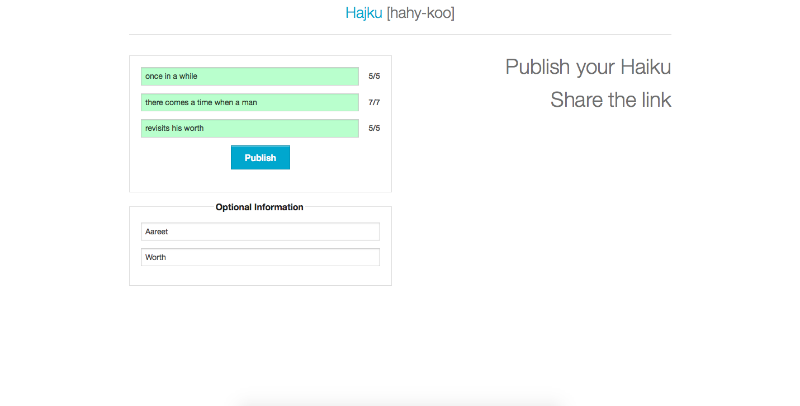

# Hajku
## A simple app to check syllables in a Haiku

I wrote this app for a high school teacher who wanted to help her schoolchildren learn to write haiku and count syllables. 
* The JS counts the syllables in each line, and marks a field red/green based on whether you have achieved the right number of syllables. 
* Syllable guidelines follow https://en.wikipedia.org/wiki/Haiku.
* They then submit their Hajku and it gives them a permalink to share with the rest of the class and their family.

A screenshot of the app is below:

